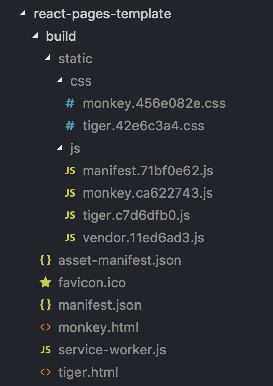

# React项目模版 - 多页
- 基于create-react-app脚手架,不破坏脚手架原有风格的基础上,做多入口/多html模版的改造,涉及到webpack-dev-server应用的改造.
- 自动扫描入口js和html模版文件.
- 热加载

# 快速上手
1. 例如,你要新增一个独立页面page-xx,那么,在`src/views/`目录下,新建文件夹`page-xx/`,并在该目录下新建入口`page-xx.js`和html模版`page-xx.html`,即可 !!  
>注意: 新建的文件夹和入口js、html模版，三者名称必须相同.
2. router、store、service、pages等模块,则推荐分别新建文件夹,将该页面对应的内容放置文件夹下;
3. common(业务无关的通用组件)、utils目录推荐公用;
4. components目录,推荐放置业务组件,是否以文件夹做区分,视情况而定;
5. assets下的`style/`目录,推荐作为所有公共css的区域,common、lib推荐作为公用,`modules/`目录推荐新建文件夹,放置各页面独有的通用css.

# 技术栈
1. `react 16 + react-router 4 + mobx 4 + webpack 3 + less/sass`
2. 开启了css模块化(`src/assets/`和`node_modules`目录排除了css模块化)
3. `node_modules`目录仅开启了css/less的非模块化,如果导入的第三方包需要用到sass/styuls等预编译预演,再添加对应的配置.
4. babel插件配置提取到了package.json

# 运行命令
```sh
npm run dev / npm run start   本地运行调试(访问地址,例: localhost:3000/page-a.html)
npm run te-build              打包测试环境代码
npm run build                 打包生产环境代码
npm run http-server           启动服务器,访问本地build目录
```

# 打包发布
>打包发布测试环境/生产环境,需要配置:
  - `scripts/te-build.js`或`scripts/build.js`下的`process.env.PUBLIC_URL`环境变量,影响的是你所有的静态资源(如:图片、js文件、css文件、字体文件等)引入路径.
  - `scripts/te-build.js`或`scripts/build.js`下的`process.env.REACT_APP_BASE_URL`环境变量,影响的是你的接口域名.

# 打包代码结构


# 为什么是webpack 3,而不是4 ?
1. webpack 4已经移除了  optimize.CommonsChunkPlugin`,转而推荐`optimization.splitChunks`进行拆包,这是唯一的原因;
2. splitChunks拆包更智能,但更不可控,vendor缓存包的提取,何时会变化不能预测;
3. 我的项目里,目前发布时还需要依赖手动修改版本号,所以必须十分清楚何时修改了vendor,也是这个原因,才将vendor的提取指定了某些包,而不是像vue-cli那样将所有出现在node_modules中的包提取到vendor.js;
4. 后期项目发布可以不依赖手动修改版本号时,将重做一个webpack 4版本.